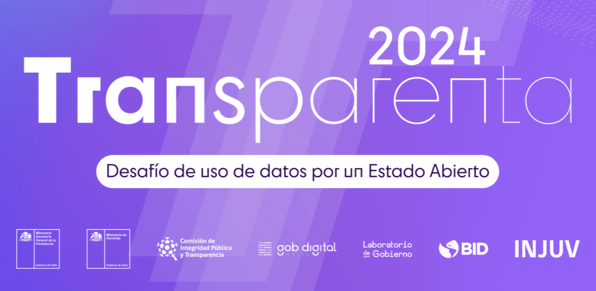

<!-- Logo -->
 

  

  <h3 align="center">ChileMateo</h3>

  

    Un visualizador de datos transparente e inclusivo
     
    <a href="https://chile-mateo.shinyapps.io/rendimientos/"><strong>Visite la página</strong></a>
     
     
    <a href="https://github.com/othneildrew/Best-README-Template/issues/new?labels=bug&template=bug-report---.md">Reportar un bug</a>
    ·
    <a href="https://github.com/othneildrew/Best-README-Template/issues/new?labels=enhancement&template=feature-request---.md">¡Contáctanos!</a>
  

<!-- Contenidos -->

  
Contenidos

  <ol>
    <li>
      <a href="#sobre-el-proyecto">Sobre el proyecto</a>
      <ul>
        <li><a href="#primeros-pasos">Primeros pasos</a></li>
        <li><a href="#Motivación">Motivación</a></li>
      </ul>
    </li>
    <li><a href="#uso">Uso</a></li>
    <li><a href="#adiciones-a-futuro">Adiciones a futuro</a></li>
    <li><a href="#sobre-nosotros">Sobre nosotros</a></li>
    <li><a href="#licencia">Licencia</a></li>
    <li><a href="#reconocimientos">Reconocimientos</a></li>
  </ol>

<!-- Sobre el proyecto -->
## Sobre el proyecto

 

Este proyecto nace gracias a la iniciativa de Transparenta 2024.

(<a href="#ChileMateo">Volver hacia arriba</a>)

### Primeros pasos

Este proyecto fue realizado completamente a través de R. Adicionalmente, este repositorio de GitHub sirvió como contenedor de todas las ideas y desarrollo del proyecto. 

(<a href="#ChileMateo">Volver hacia arriba</a>)

<!-- Motivación -->
## Motivación

Nuestra motivación para llevar a cabo esta visualización viene desde el sentimiento de poder tener a mano el rendimiento escolar de las generaciones más jovenes de nuestro país. La educación básica es un proceso importante dentro del desarrollo escolar de nuestro país y seguir de cerca el desempeño de les niñes nos ayuda a entender en como podemos mejorar nuestros modelos de enseñanza y así poder llevar una educación de primer nivel y, obviamente, más equitativa entre todos los habitantes del país. 

<!--Uso-->
## Uso

El uso de esta página web es libre y gratuito. Los datos recopilados son de acceso público a través de la <a href="https://datosabiertos.mineduc.cl">página de Datos Abiertos del MINEDUC</a>. Queda a disposición del usuario la utilización de los datos para fines académicos, de investigación o de consulta. 

Por nuestra parte desaconsejamos utilizar esta herramienta para consultar los rendimientos por establecimiento educacional y compararlos entre sí. La educación es un proceso complejo y multifactorial, y los rendimientos académicos no son un indicador suficiente para evaluar la calidad de un establecimiento educacional.

(<a href="#ChileMateo">Volver hacia arriba</a>)

<!-- Adiciones a futuro -->
## Adiciones a futuro

- [x] Crear la página
- [x] Añadir variables de interés en la visualización
- [ ] Añadir más comunas a la visualización
- [ ] Añadir más años a la visualización
- [ ] Añadir múltiples idiomas
    - [ ] Inglés
    - [ ] Mapudungun
- [ ] Añadir más variables de interés
- [ ] Mezclas más bases de datos

(<a href="#ChileMateo">Volver hacia arriba</a>)

<!-- CONTRIBUTING -->
## Sobre nosotros

Este proyecto fue realizado por Liam Obilinovic e Ignacio Serrano, ambos estudiantes de la carrera de Sociología de la Pontificia Universidad Católica de Chile. 

Si tienes alguna duda o sugerencia, no dudes en contactarnos a través de nuestras redes sociales o correos electrónicos.

Liam Obilinovic - [GitHub](https://github.com/liamobilinovic) - [Correo](mailto:obilinovic36@gmail.com) - [Instagram](https://www.instagram.com/plutoneraplaneta/)

Ignacio Serrano - [GitHub]() - [Correo](mailto:) - [Instagram](https://www.instagram.com/the_rondabout/)

(<a href="#ChileMateo">Volver hacia arriba</a>)

<!-- LICENSE -->
## Licencia

Copyright (c) 2024 Liam Obilinovic.

Copyright (c) 2024 Ignacio Serrano.

Permission is hereby granted, free of charge, to any person obtaining a copy of this software and associated documentation files (the "Software"), to deal in the Software without restriction, including without limitation the rights to use, copy, modify, merge, publish, distribute, sublicense, and/or sell copies of the Software, and to permit persons to whom the Software is furnished to do so, subject to the following conditions:

The above copyright notice and this permission notice shall be included in all copies or substantial portions of the Software.

THE SOFTWARE IS PROVIDED "AS IS", WITHOUT WARRANTY OF ANY KIND, EXPRESS OR IMPLIED, INCLUDING BUT NOT LIMITED TO THE WARRANTIES OF MERCHANTABILITY, FITNESS FOR A PARTICULAR PURPOSE AND NONINFRINGEMENT. IN NO EVENT SHALL THE AUTHORS OR COPYRIGHT HOLDERS BE LIABLE FOR ANY CLAIM, DAMAGES OR OTHER LIABILITY, WHETHER IN AN ACTION OF CONTRACT, TORT OR OTHERWISE, ARISING FROM, OUT OF OR IN CONNECTION WITH THE SOFTWARE OR THE USE OR OTHER DEALINGS IN THE SOFTWARE.

(<a href="#ChileMateo">Volver hacia arriba</a>)

<!-- Reconocimientos -->
## Reconocimientos

Los siguientes sitios webs, herramientas y paquetes de R fueron de gran ayuda para la realización de este proyecto:

* [Paletas de colores](https://coolors.co)
* [Generador de gradientes CSS](https://cssgradient.io)
* [Generador de paleta de gradientes](https://coolors.co/gradient-palette/b15b86-440f50?number=7)
* [GitHub](https://github.com)
* [Leaflet](https://leafletjs.com)
* [Shiny](https://shiny.posit.co/r/getstarted/shiny-basics/lesson1/index.html)
* [Font Awesome](https://fontawesome.com)
* [PlotLy](https://plotly.com)
* [RStudio](https://posit.co/products/open-source/rstudio/)

(<a href="#ChileMateo">Volver hacia arriba</a>)

